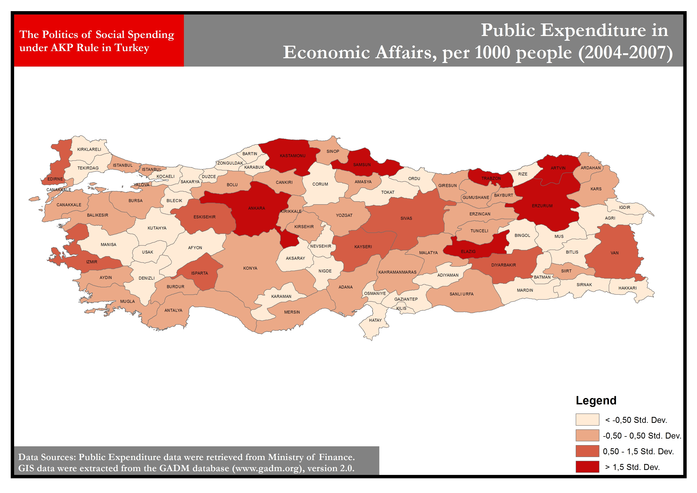
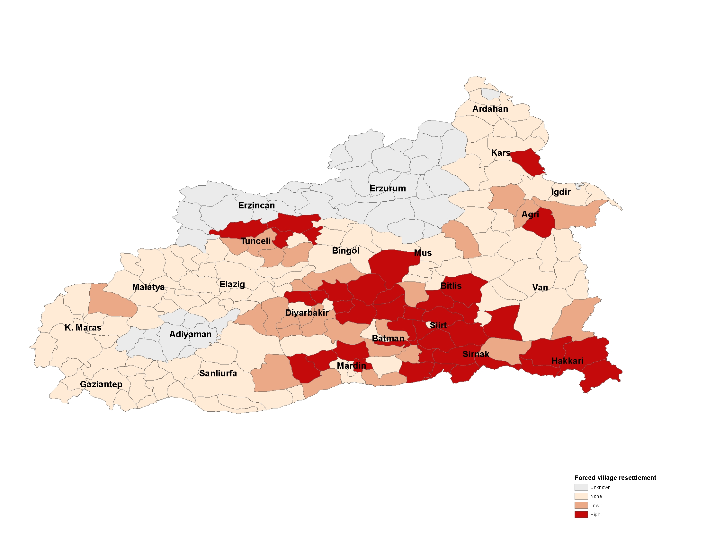
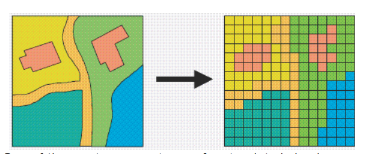
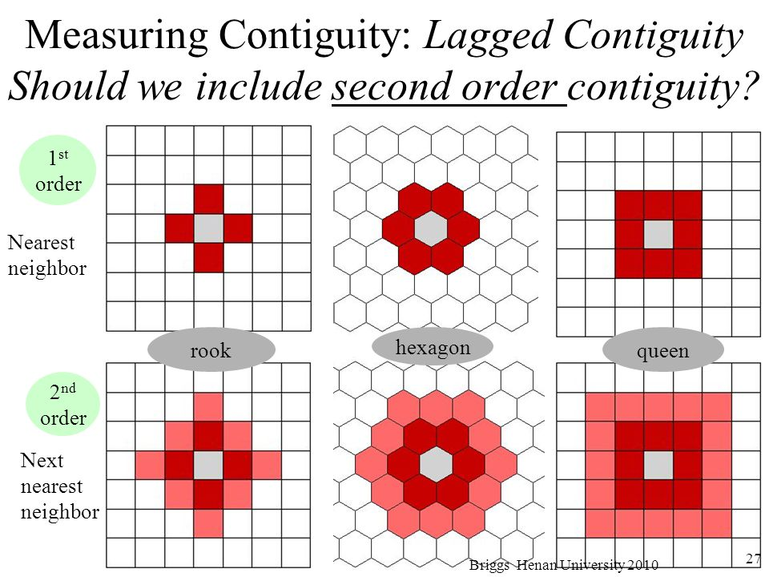
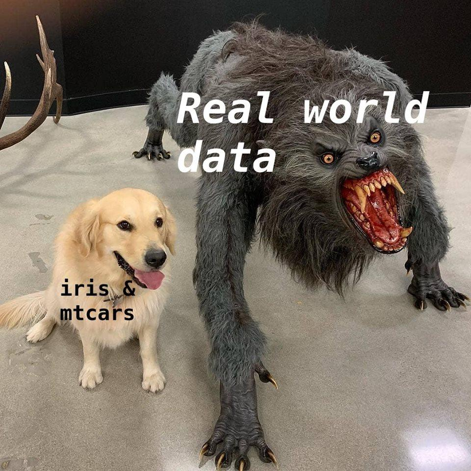
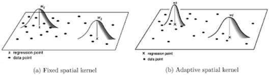

<style>
pre {
  white-space: pre !important;
  overflow-y: scroll !important;
  max-height: 50vh !important;
}
</style>
```{r setup, include=FALSE}
options(htmltools.dir.version = FALSE)
```

```{r theme, include=FALSE, warning=FALSE}
library(xaringanthemer)
style_duo(primary_color = "#1F4257", secondary_color = "#F97B64")
```
---
class: inverse, center, middle
background-image: url("introspatial.jpg")
background-position: center
background-size: contain

---

# Presentation Outline

--

- What do we mean by spatial data?

--

- What the heck is spatial dependence?

--

- Why should we take it seriously?

--

- When should we apply spatial analysis?

--

- Which R packages and skills required?

--

- Two main approaches to spatial analysis

--

- A basic R application

--

- Additional Resources

--

- Extra: Spatial Non-stationarity; Spatial Analysis for Panel Data

---

class: inverse, center, middle
# What do we mean by spatial data?

---

# Spatial data

--

- areal data

```{r, echo=FALSE, out.width = "80%", out.height = "80%", fig.align = 'center'}

```

--
---

# Spatial data

- point pattern data


```{r, echo=FALSE, fig.align = 'center'}
knitr::include_url("beta map.html")
```

--

- space doesn't always mean geography

---

class: inverse, center, middle
# What the heck is spatial dependence?

---

# Spatial Dependence

--
.pull-left[
**1. Diffusion**
]

.pull-right[
There are plenty of applications in PoliSci: 
- diffusion among IOs (Sommerer and Tallberg 2018)
- coups (Miller et al. 2016)
- conflict (Kelling and Lin 2019)
- protests (Crabtree et al. 2015)
- self-determination (Cunningham and Sawyer 2017)
]

--

**2. Attributional Dependence**

--

**3. Spatially Correlated Exogenous Shocks**

---

class: inverse, center, middle
# Why should we take it seriously?

---

# Spatial Dependence

A generic spatial model for cross-sectional data from $Anselin(1988, 34)$:

$$y= \rho W_{1} y + X\beta + \epsilon$$

$$\epsilon = \lambda W_{2}\epsilon + \mu$$
--

- What if diffusion process exists?

--

  + Omitted variable bias

--

  + OLS assumption violation

--

- What if error terms are clustered?

--
  + OLS assumption violation

--

- Generic example: the impact of development on democracy

---

class: inverse, center, middle
# When should we apply spatial analysis?

---

# Spatial Analysis

If the response variable is spatially dependent? Nope.

```{r, echo=FALSE, fig.align = 'center', out.width="70%", out.height="70%"}

```

---

# Spatial Analysis

If the primary interest is not spatial inference, then there might be other estimation strategies instead of spatial analysis. 

--

- Let's say there is no diffusion but just error dependence. Can we just use clustered standard errors? You may use `cluster.vcov` function from `multiwayvcov` or `sandwich` packages. When would this work?
--

- How about HAC-estimators? `vcovHAC()` from `sandwich` package.

--

- Then check `lm.morantest()` from `spdep` package.<sup>1</sup>

.footnote[
  The global Moran's I measure can only help us to identify whether there are any clustering characteristics in a given space, but cannot delineate clustering regions. To that aim, you need local Moran's I (LISA) statistic. 
  
  For a **very interesting** paper on using spatial analysis and LISA statistic for mixed-method case selection strategy, see **Ingram and Harbers, 2019, "Spatial Tools for Case Selection: Using LISA Statistics to Design Mixed-Methods Research", PSRM.**]

---

class: inverse, center, middle
# Which skills and R packages you need?

---

## Mapping skills

--

.pull-left[
- First, you should be able to import spatial data into R. 
  + `rnaturalearthdata` and `rnaturalearth` packages help you access free vector and raster map data from the Natural Earth. 
]

.pull-right[
```{r, echo=FALSE, out.width="70%", out.height="70%", fig.align='right', fig.cap="Vector vs. raster data. Source: ESRI."}

```
]

--

  + Spatial data are stored in different formats, and sometimes it is painful to quickly import it to R environment. Two packages are helpful: `readOGR` function from `rgdal` package, or `raster` package.
  
--

  + `sp` package has been replaced by `sf`. Get familiar with the `sf` package. Instead of relying on ESRI shapefiles, `sf` package allows storing spatial data with simple feature attributes such as y point, line, and polygon geometries. What makes it beautiful is that it is compatible with tidyverse and allows us to treat spatial data object as data.frames. You may use `geom_sf()` function to draw incredible maps.

---
## Spatial Analysis

.pull-left[
  + You need to know how to calculate a weighting contiguity matrix. `spdep` package.
  
  + For spatial estimation: `spatialreg` package.
]

.pull-right[
  How do we define neighbors? Queen contiguity, k-nearest neighbor etc.
  
```{r, echo=FALSE, fig.align="right", fig.cap="Source: Angela Li, Spatial Analysis Workshop."}

```

]  

---
class: inverse, center, middle
# Two Approaches to Spatial Estimation
---
# Spatial Estimation


$$y= \rho W_{1} y + X\beta + \epsilon$$

$$\epsilon = \lambda W_{2}\epsilon + \mu$$

- Spatial error model

--

- Spatially lagged model

---
class: inverse, center, middle
# A Basic R Application

Is polarization contagious?

---
```{r, out.height="100%", out.width="100%", echo=FALSE, fig.pos="center"}

```
---

## Installing Packages and Data Setup
```{r, echo=T, warning=FALSE, message=FALSE, cache=FALSE}
## Packages ----------------------
packages <- c("spdep", "spatialreg", "sf", "here",
          "rnaturalearth", "rnaturalearthdata", "tidyverse")
installed <- packages %in% rownames(installed.packages())
if (any(installed == FALSE)) install.packages(packages[!installed])
invisible(lapply(packages, library, character.only = TRUE))

## Data Setup --------------------
set.seed(123)
options(scipen = 999)

## V-dem Data
vdem <- readRDS("data/vdem.RDS")
vdem <- vdem %>% filter(year==2018) %>%
  select(country_name, v2smpolsoc, v2cacamps, v2x_delibdem, v2xel_frefair,
         v2x_cspart, v2x_freexp_altinf, v2regsupgroupssize) 

## SF Data
world <- ne_countries(scale = "large", returnclass = "sf", #<<
                      country = vdem$country_name) #<<
world <- world %>% rename(country_name = sovereignt)
world <- left_join(world, vdem, by="country_name")
```

---
## Visualization

```{r visual, echo=T, warning=FALSE, message=FALSE, cache=FALSE, fig.pos="center"}
world %>%
  ggplot() + geom_sf(aes(fill=v2smpolsoc)) +
  scale_fill_viridis_c(alpha = .8, option="inferno") + 
  theme_bw()
```

---
## Spatial Weights

```{r spatial, echo=T, warning=FALSE, message=FALSE, cache=FALSE, fig.pos="center", fig.show="hide"}
## Spatial Weight Matrix ---------------
coords <- st_centroid(st_geometry(world), of_largest_polygon=TRUE)
col.knn <- knearneigh(coords, k=2) ## k-nearest approach

nb.matrix <- knn2nb(col.knn)
list.w <- nb2listw(nb.matrix, style = "W")

plot(st_geometry(world), border="grey")
plot(knn2nb(col.knn), coords, add=TRUE)
```

---
## Neighborhood Plot
`)
---
## Spatial Estimation
```{r, echo=T, warning=FALSE, message=FALSE, cache=FALSE}
mod1 <- v2smpolsoc ~ v2x_delibdem + v2xel_frefair +
  v2x_cspart + v2x_freexp_altinf + v2regsupgroupssize

model1 <- lagsarlm(mod1, data = world, listw = list.w) #spatial lag
model2 <- errorsarlm(mod1,data = world, listw = list.w) #spatial error
```
---
## Spatial Lag Model
```{r, echo=FALSE}
summary(model1)
```
---
## Spatial Error Model
```{r, echo=FALSE}
summary(model2)
```
---
class: inverse, center, middle
# Additional Resources
---
# Additional Resources

.pull-left[
## Books

- Darmofal, David. 2015. Spatial Analysis for the Social Sciences. New York: Cambridge University Press. 
- Ward, Michael, and Kristian Gleditsch. 2011. Spatial Regression Models. New York: SAGE Publications, Inc.
- Chi, Guangqing, and Jun Zhu. 2019. Spatial Regression Models for the Social Sciences. New York: SAGE Publications, Inc.
]

.pull-right[
## Websites

- https://rspatial.org/ 

## People to Follow

- Robert J. Franzese 
- Matthew Ingram
]

---
class: inverse, center, middle
# Thanks!
---

# Extra: Spatial Non-stationarity

In order to explore spatial heterogeneity, one data-driven technique that may be used is Geographically Weighted Regression.

Local regression with kernel smoothing:

$$y_{i} = m(x_{i}) + \mu_{i}$$
```{r, echo=FALSE, out.height="60%", out.width="60%", fig.align='center'}


```

To run GWR with adaptive kernel, you can use `gwr.sel` function from `spgwr` package.
